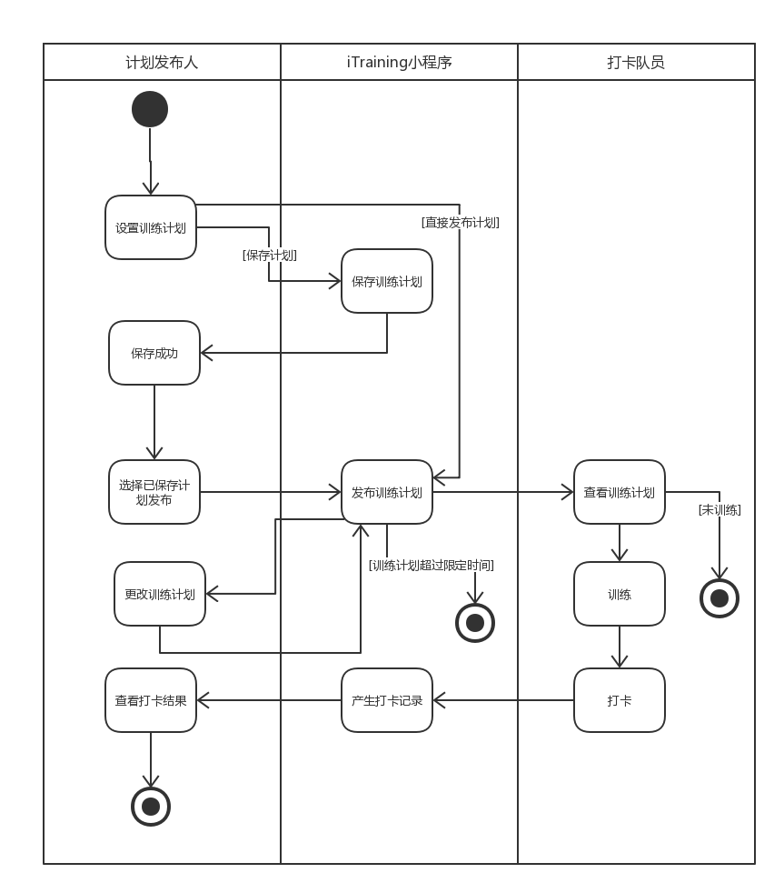

# 业务建模

> 对于客户而言我们的小程序的核心业务在下面几点：
>
> 1. 创建队伍&添加队员
> 2. 发布训练计划&训练打卡
> 3. 查看训练成绩

| 业务                  | 活动图                                                       |
| --------------------- | ------------------------------------------------------------ |
| 创建队伍&添加队员     |  |
| 发布训练计划&训练打卡 |  |
| 查看训练成绩          |  |

