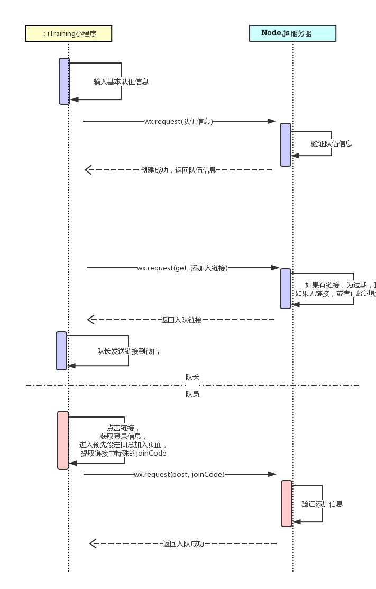

# 系统顺序图

>  该文档主要阐明前后端在实际业务中的交互顺序，以及接口数据

| 业务              | 顺序图                                                       |
| ----------------- | ------------------------------------------------------------ |
| 小程序登录        |  |
| 创建队伍&邀请队员 |  |
| 创建训练计划&打卡 |  |

