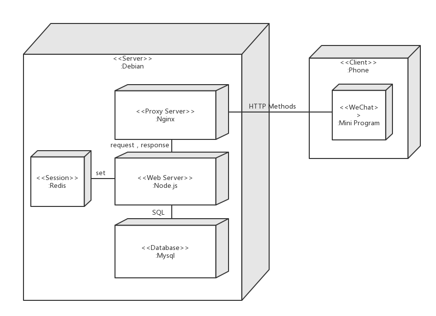
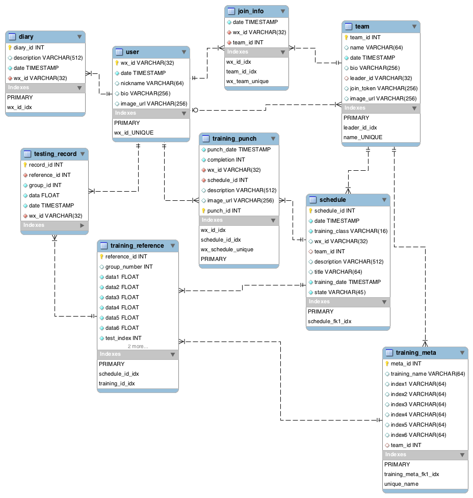
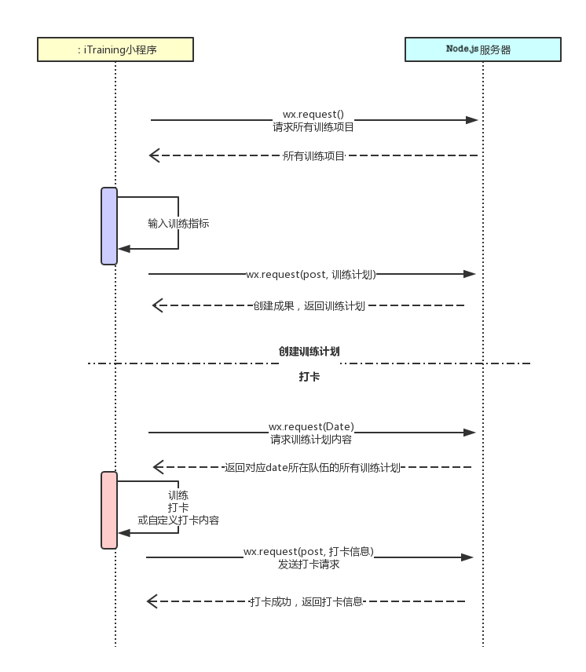
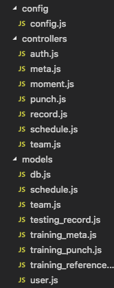

# *iTraining*详细设计说明书

> 这是iTraining小程序的后端设计文档
>
> by 沅 海

## 1. 引言

### 1.1 编写目的

iTraining系统设计文档主要对功能模块进行过程描述，设计功能模块的内部细节，包括算法和详细数据结构，对实现细节做精确的描述。

### 1.2 项目背景

高校校运动队常规训练基本采取队长在微信或qq群内发布公告说明训练计划的开放状态，队员收到后执行训练计划，训练结束后或无反馈，或只是单纯的群内汇报训练情况，，无法充分挖掘训练效果，所以一个好的训练管理对于大学校运动训练队来说是必需的。

好的训练打卡系统可以更好的帮助队长发布训练计划，使得队员打卡的反馈情况更有条理，同时队长可以通过打卡记录快速获得全队的训练情况，改进训练计划，从而提高队伍整体素质 。iTraining便是基于此背景应运而生。

### 1.3 定义

微信开发者工具：开发工具，

### 1.4 参考资料

> 《软件工程导论——第五版》 张海藩编著 清华大学出版社

## 2. 技术选型理由

项目前端采用的是微信小程序自带框架 ，后端采用的技术栈是*Nginx* + *Node.js* + *Mysql*，主要选型原因有以下几条：

> 微信小程序自带框架  

- 一开始考虑是否用java开发android端的应用，但是发现这样可能不能普及到ios用户，所以这里我们选择使用微信小程序框架。同时是因为微信小程序框架的入口方便，可以直接在微信进入，而且可以直接用户微信授权，免去用户手动注册登录。

> *Node.js*    [后端项目仓库](https://github.com/iTraining/Server)

- 我们对*iTraining*进行系统的需求分析后，认为随应用的用户量不断增长，应用在服务端对数据库的操作是频繁的，属于I/O密集型的应用，所以服务进程很长时间处于等待状态，另一方面为了应付新的请求不断的增加新的进程，这样的浪费会导致系统支持QPS远远小于后端数据服务能够支撑的QPS。为了解决应用后台可能面临的高密集请求的阻塞情况，我们打算采用*Node.js*（一种基于*Chrome V8*引擎的*JavaScript*运行时）。*Node.js* 使用了一个事件驱动、非阻塞式I/O 的模型，使其轻量又高效。
- *Node.js*可用的后端框架很多，比如*express、koa*等，我们选择*express*框架，因为后端程序员对*express*比较熟悉，并且*express*简单实用，易于上手，中间件自由度高，特别是其中的session信息插件，大大简化了连接redis数据库管理session的过程。

> *Nginx*    [nginx.conf](https://github.com/iTraining/Server/blob/master/nginx_configuration/nginx.conf)

- 由于前端采用的是小程序，同时考量SSL的安全性，我们这里为我们的后台申请了SSL证书，使得前端可以用*https*请求后代API。为了实现SSL认证，这里后台我们使用*Nginx*反向代理Node.js的服务器，将外界的请求代理到*Node.js*服务器。*Nginx*服务器还能用于后台静态资源的管理。

> *Mysql*    [itraining.sql](https://github.com/iTraining/documents/blob/master/assets/db/itraining.sql)    [设计文件](https://github.com/iTraining/documents/tree/master/assets/db)

- *iTraining*业务中涉及多个对象关系，这里使用*Mysql*关系型数据库，足以满足基本的需求。

## 2. 架构设计

### 2.1 简介：架构表示

​	我们将在文档中用一系列视图表示我们的软件项目架构：逻辑视图、物理视图。下面的视图介绍将采用UML图的形式进行介绍。

### 2.2 逻辑视图

这里逻辑视图我应用经典三层架构设计，使用express的路由解决请求，分向各个类别的服务。（[路由解析器代码](https://github.com/iTraining/Server/blob/master/routes.js)）

### 2.3 物理视图

我采用腾讯云的代理服务器，在Debian 4.9的系统上运行服务器程序，如下是这个应用的物理视图。

## 3. 领域建模与ER逻辑图

- 领域建模：

- ER逻辑图：

## 4. 系统顺序图

>  该文档主要阐明前后端在实际业务中的交互顺序，以及接口数据

| 业务              | 顺序图                                                       |
| ----------------- | ------------------------------------------------------------ |
| 小程序登录        |  |
| 创建队伍&邀请队员 |  |
| 创建训练计划&打卡 |  |

## 5. 模块划分

- 前端：
    前端系统结构由3大模块，6小模块组成：

    

    | **序号** | **编号** | **名称**               |
    | -------- | -------- | ---------------------- |
    | 1        | 01       | 注册队伍模块           |
    | 2        | 02       | 管理模块               |
    | 2        | 021      | 邀请队友模块           |
    | 3        | 022      | 添加训练项目模块       |
    | 4        | 023      | 队长制定并发布计划模块 |
    | 5        | 024      | 队友打卡并发布打卡动态 |
    | 6        | 031      | 队伍成员查看计划       |
    | 7        | 032      | 队伍成员查看打卡动态   |

    - **前端各模块详情见**：[前端模块详细设计说明](前端模块详细设计说明.md)

- 后端：
    后端根据架构设计划分成四大模块：请求解析分发模块、控制器模块（服务）模块、数据对象（模型）模块、数据库接口模块，下面显示了[Server](https://github.com/iTraining/Server)文件目录对应模块。

    | 模块架构对应关系                               | 后端目录结构（代码详情见[这里](https://github.com/iTraining/Server)) |
    | ---------------------------------------------- | ------------------------------------------------------------ |
    |  |    |

## 5. 软件设计技术

| 设计模式                             | 代码出处                                                     |
| ------------------------------------ | ------------------------------------------------------------ |
| Middlewares/ pipelines（中间件模式） | [express对象中间件模式实例](https://github.com/iTraining/Server/blob/master/app.js#L15) |
| Dependency Injection（依赖注入模式） |                  |

