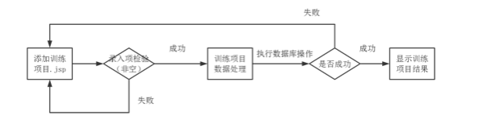

# 前端模块详细设计说明

>  前端系统结构由3大模块，6小模块组成：

| **序号** | **编号** | **名称**               |
| -------- | -------- | ---------------------- |
| 1        | 01       | 注册队伍模块           |
| 2        | 02       | 管理模块               |
| 2        | 021      | 邀请队友模块           |
| 3        | 022      | 添加训练项目模块       |
| 4        | 023      | 队长制定并发布计划模块 |
| 5        | 024      | 队友打卡并发布打卡动态 |
| 6        | 031      | 队伍成员查看计划       |
| 7        | 032      | 队伍成员查看打卡动态   |

## 01 注册队伍模块

### 1.1 功能流程图

|  |
| :--: |
| 图2.1 注册队伍功能流程图 |

- 需要说明的问题：

    1. 录入项检测由javescript实现（各项必须非空）
    2. 注册队伍成功后即可进入管理模块，即邀请队友、制定并发布计划等

### 1.2 界面设计

**（1）基础信息处理**

| **动作编号** | **动作名称** | **动作描述**                                     |
| ------------ | ------------ | ------------------------------------------------ |
| A01          | 授权登录     | 用户点击授权操作进入                             |
| A02          | 创建队伍     | 用户点击创建队伍，提交数据到注册队伍数据处理页面 |

**（2）数据要求**

| **字段名称** | **长度** | **录入方式** | **是否非空项目** | **数据检验** |
| ------------ | -------- | ------------ | ---------------- | ------------ |
| 队伍名称     | 10       | 文本框       | Y                | N            |
| 队伍简介     | 20       | 文本框       | Y                | N            |
| 队伍头像     | 1        | 选择手机图片 | Y                | N            |

**（3）界面呈现**

|  |
| :----------------------------------------: |
|             图2.1 注册队伍页面             |

### 1.3 注册队伍数据处理js的内部逻辑

 

## 02 管理模块

### 2.1 功能流程图

|  |
| :----------------------------------------------------------: |
|                  图2.2-a 管理模块功能流程图                  |

- 需要说明的问题：

	1. 在选择相应的业务时，需要在当前的页面显示；

### 2.2 **功能描述**

（1）功能类型：其他

（2）功能概述：iTraining的主体训练管理业务

（3）前提业务：注册队伍模块（01）

（4）后续业务：021，022,023,024

（5）功能约束：其他

### 2.3 界面设计

**（1） 基本信息处理**

| **动作编号** | **动作名称**     | **动作描述**                                                 |
| ------------ | ---------------- | ------------------------------------------------------------ |
| A01          | 邀请队友加入     | 队长点击按钮，将小程序发现页分享给队友                       |
| A02          | 队友点击加入队伍 | 队友获得小程序发现页，点击按钮加入队伍                       |
| A03          | 添加训练项目     | 队长点击按钮，将页面转至训练项目专栏页面                     |
| A04          | 制定训练计划     | 队长点击按钮，将页面跳转到制定训练计划页面                   |
| A05          | 打卡并发布动态   | 队伍成员点击打卡按钮，进入打卡页面，打卡之后进行发布打卡动态页面 |

**（2）数据要求**

按操作指引数据要求

**（3）界面呈现**

|  |
| :--------------------------------------------------------: |
|                   图2.2 个人中心管理页面                   |

## 021 邀请队友模块

### 3.1 **功能流程图**

|  |
| :----------------------------------------------------------: |
|                   图2.3 邀请队伍功能流程图                   |

### 3.2 **界面设计**

**（1）基本信息处理**

| **动作编号** | **动作名称**     | **动作描述**                           |
| ------------ | ---------------- | -------------------------------------- |
| A01          | 邀请他人加入     | 队长点击按钮，将小程序发现页分享给队友 |
| A02          | 队友点击加入队伍 | 队友获得小程序发现页，点击按钮加入队伍 |

1. 数据要求

微信账号授权即可。

**（3）界面呈现**

|  |
| :----------------------------------------------------------: |
|             图2.4 队长邀请队友及队友加入队伍页面             |

### 3.3 邀请队友模块内部js逻辑

## 022 添加训练项目模块

### 4.1 功能流程图

|  |
| :----------------------------------------------------------: |
|                 图2.5 添加训练项目功能流程图                 |

### 4.2 界面设计

**（1）基本信息处理**

| **动作编号** | **动作名称**         | **动作描述**                                 |
| ------------ | -------------------- | -------------------------------------------- |
| A01          | 添加项目             | 队长点击按钮，进入添加项目信息页面           |
| A02          | 设定项目相关指标数   | 队友设置指标数目，页面显示待选指标名称及单位 |
| A03          | 队长逐一选择相关指标 | 队长点击并确定项目相关指标                   |

1. 界面呈现

|  |
| :----------------------------------------------------------: |
|                  图2.6 添加训练项目界面设计                  |

### 4.3 添加训练项目模块内部js逻辑

## 023 队长制定并发布计划模块

### 5.1 功能流程图

|  |
| :----------------------------------------------------------: |
|                    图2.7 队长制定训练计划                    |

### 5.2 界面设计

**（1）基本信息处理**

| **动作编号** | **动作名称**         | **动作描述**                                           |
| ------------ | -------------------- | ------------------------------------------------------ |
| A01          | 队长制定计划         | 队长点击按钮，进入制定训练计划页面                     |
| A02          | 设定计划抬头信息     | 队友设置计划标题，计划简介等信息                       |
| A03          | 队长动态添加训练项目 | 队长点击添加项目进入添加计划中项目页面                 |
| A04          | 队长发布计划         | 队长确定添加项目后点击发布计划，页面跳转到打卡计划页面 |

1. 界面呈现

|  |  |
| ------------------------------------------------------------ | ------------------------------------------------------------ |
|  |  |

​								图2.8 队长制定训练计划页面

### 5.3 制定并发布计划模块内部js逻辑

## 024 队伍成员**打卡**并发布动态模块

### 6.1 功能流程图

|  |
| :----------------------------------------------------------: |
|                 图2.9 队伍成员打卡并发布动态                 |

### 6.2 界面设计

**（1）基本信息处理**

| **动作编号** | **动作名称**               | **动作描述**                            |
| ------------ | -------------------------- | --------------------------------------- |
| A01          | 队伍成员打卡               | 队伍成员点击打卡按钮，进入打卡页面      |
| A02          | 队伍成员打卡后发布训练动态 | 队伍成员输入心得、图片（1张）及满意度。 |

**（2）界面呈现**

|  |
| :----------------------------------------------------------: |
|  |
|              图2.10 队伍成员打卡并发布动态页面               |

### 6.3 队伍成员打卡及发布动态模块内部js逻辑

## 031 队伍成员**查看计划**模块

### 7.1 界面设计

**（1）基本信息处理**

| 动作编号 | 动作名称                 | 动作描述                                   |
| -------- | ------------------------ | ------------------------------------------ |
| A01      | 队伍成员查看打卡计划     | 队伍成员点击打卡按钮，进入查看打卡计划页面 |
| A02      | 队伍成员查看历史训练计划 | 队伍成员进入个人中心，查看历史训练计划     |

**（2）界面呈现**

|  |
| :----------------------------------------------------------: |
|               图2.10 队伍成员查看计划页面设计                |

### 7.2 队伍成员查看计划模块内部js逻辑

|  |
| :----------------------------------------------------------: |
|  |

## 032 队伍成员查看打卡动态模块

### 8.1 界面设计

**（1）基本信息处理**

| **动作编号** | **动作名称**         | **动作描述**                           |
| ------------ | -------------------- | -------------------------------------- |
| A01          | 队伍成员查看打卡动态 | 队伍成员点击动态按钮，查看队友打卡动态 |

**（2）界面呈现**

|  |
| :----------------------------------------------------------: |
|               图2.11 队伍成员查看队友打卡动态                |

### 8.2 队伍成员查看打卡动态模块内部js逻辑

