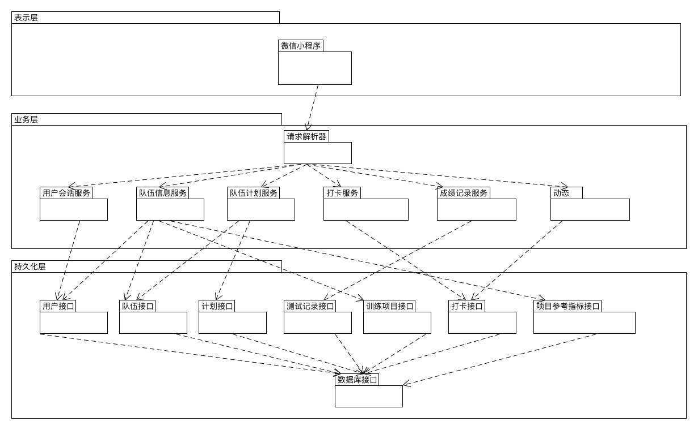
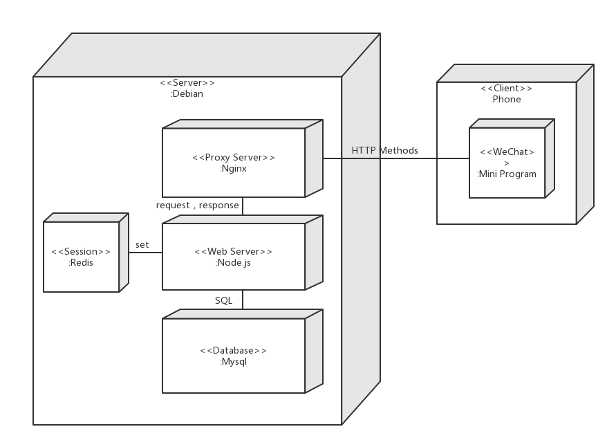
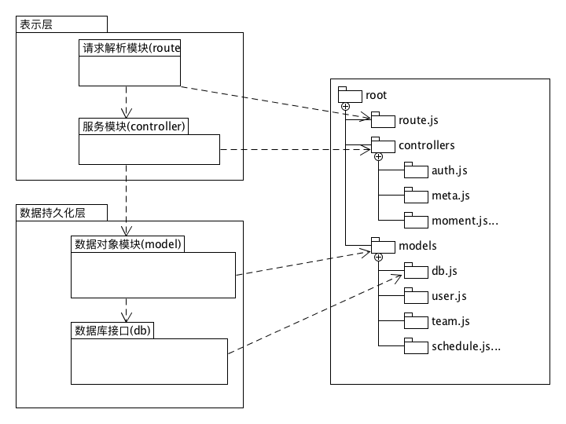
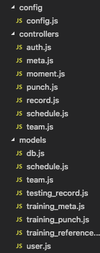
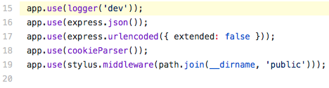
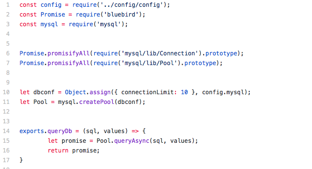

# 后端设计文档

> 这是iTraining小程序的后端设计文档
>
> by 沅

## 1. 技术选型理由

我在后端采用的技术栈是*Nginx* + *Node.js* + *Mysql*，主要选型原因有以下几条：

> *Node.js*    [后端项目仓库](https://github.com/iTraining/Server)

- 我们对*iTraining*进行系统的需求分析后，认为随应用的用户量不断增长，应用在服务端对数据库的操作是频繁的，属于I/O密集型的应用，所以服务进程很长时间处于等待状态，另一方面为了应付新的请求不断的增加新的进程，这样的浪费会导致系统支持QPS远远小于后端数据服务能够支撑的QPS。为了解决应用后台可能面临的高密集请求的阻塞情况，我们打算采用*Node.js*（一种基于*Chrome V8*引擎的*JavaScript*运行时）。*Node.js* 使用了一个事件驱动、非阻塞式I/O 的模型，使其轻量又高效。
- *Node.js*可用的后端框架很多，比如*express、koa*等，我们选择*express*框架，因为后端程序员对*express*比较熟悉，并且*express*简单实用，易于上手，中间件自由度高，特别是其中的session信息插件，大大简化了连接redis数据库管理session的过程。

> *Nginx*    [nginx.conf](https://github.com/iTraining/Server/blob/master/nginx_configuration/nginx.conf)

- 由于前端采用的是小程序，同时考量SSL的安全性，我们这里为我们的后台申请了SSL证书，使得前端可以用*https*请求后代API。为了实现SSL认证，这里后台我们使用*Nginx*反向代理Node.js的服务器，将外界的请求代理到*Node.js*服务器。*Nginx*服务器还能用于后台静态资源的管理。

> *Mysql*    [itraining.sql](https://github.com/iTraining/documents/blob/master/assets/db/itraining.sql)    [设计文件](https://github.com/iTraining/documents/tree/master/assets/db)

- *iTraining*业务中涉及多个对象关系，这里使用*Mysql*关系型数据库，足以满足基本的需求。

## 2. 架构设计

### 2.1 简介：架构表示

​	我们将在文档中用一系列视图表示我们的软件项目架构：逻辑视图、物理视图。下面的视图介绍将采用UML图的形式进行介绍。

### 2.2 逻辑视图

这里逻辑视图我应用经典三层架构设计，使用express的路由解决请求，分向各个类别的服务。（[路由解析器代码](https://github.com/iTraining/Server/blob/master/routes.js)）

### 2.3 物理视图

我采用腾讯云的代理服务器，在Debian 4.9的系统上运行服务器程序，如下是这个应用的物理视图。

## 3. 模块划分

我根据架构设计，将后端划分成四大块：请求解析分发模块、控制器模块（服务）模块、数据对象（模型）模块、数据库接口模块，下面显示了[Server](https://github.com/iTraining/Server)文件目录对应模块。

| 模块架构对应关系                               | 后端目录结构（这里只显示了部分，详情见[这里](https://github.com/iTraining/Server)) |
| ---------------------------------------------- | ------------------------------------------------------------ |
|  |    |

## 4. 软件设计技术

| 设计模式                             | 代码出处                                                     |
| ------------------------------------ | ------------------------------------------------------------ |
| Middlewares/ pipelines（中间件模式） | [express对象中间件模式实例](https://github.com/iTraining/Server/blob/master/app.js#L15) |
| Dependency Injection（依赖注入模式） |                  |

