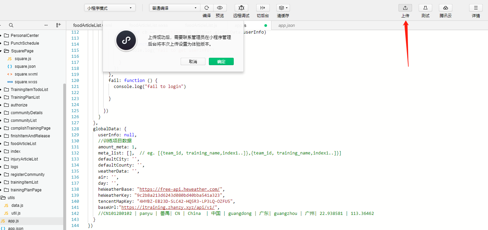

# 安装部署说明

[TOC]

## 一、 说明安装环境，步骤

### 小程序配置[ 安装方法 ]

1. 获取小程序前端源码   git clone https://github.com/iTraining/prototype.git

2. 创建小程序工程，选择克隆源码文件夹为项目根文件夹

3. 导入到微信开发者工具中 修改配置文件 

   

4. 修改合法域名(设置为安装的https域名 )

   yuming.png)

5. 上传提交给腾讯 (等待审核)

   

   

### 系统后端部署

#### 1.环境配置

| 系统版本要求 | Debian/Ubuntu                                  |
| ------------ | ---------------------------------------------- |
| 软件         | git、node、mysql、redis-server、nginx、forever |

> [Linux环境配置脚本](https://github.com/zhanzongyuan/linux-configuration)
>
> Nginx安装：`sudo apt-get install nginx`
>
> forever安装：`sudo npm install forever -g`

#### 2. 部署

##### 2.1 安装配置Node.js服务器

> 由于Redis服务器安装后已经运行在后台，这里不再介绍Redis的安装配置

######2.1.1 安装

```
mkdir ~/iTraining
cd ~/iTraining
git clone git@github.com:iTraining/Server.git
cd ~/iTraining/Server
mkdir uploads && mkdir uploads/img
npm install
```

###### 2.1.2 Mysql和Redis配置

- 初始化Mysql数据库：在环境配置中已经安装Mysql、Redis，这里我们只需要为Mysql、Redis配置账号密码，在Mysql中需要初始化数据库，首先要把[数据库初始化脚本](https://github.com/iTraining/documents/tree/master/assets/db)，下载到服务器后，进入服务器，安装：

  ```
  wget https://raw.githubusercontent.com/iTraining/documents/master/assets/db/itraining.sql
  mysql -u root -p
  ...
  > source itraining.sql
  ```

- Server配置数据库连接：再在Server中修改配置文件，使其能够通过账号密码连接上Mysql，下面是`Server/config.js`中Mysql账号密码的配置：

  ```
  module.exports = {
      mysql: {
          host: '127.0.0.1',
          user: 'root',
          password: 'password',
          database: 'itraining'
      },
      redisConfig: {
          'cookie' : {
              'maxAge' : 1800000  // 30 * 60 * 1000 ms = 30 mins
           },
           'sessionStore' : {
               'host' : '127.0.0.1',
               'port' : '6379',
               'db' : 1,
               'ttl' : 1800, // 60 * 30 sec = 30 mins
               'logErrors' : true
           }
      },
      invite_token_ttl: 1000*60*30  // 30 mins
  }
  ```

###### 2.1.3 运行应用服务器

配置好相关数据库后，这里直接在Server根目录下运行服务器、或者通过forever后台运行

```
cd ~/iTraining/Server
npm run start # 直接运行
forever start -c “npm run start” ./ # 后台运行
```

##### 2.2 配置Nginx

通过apt-get安装Nginx后可以看到这个文件`/etc/nginx/nginx.conf`，这个就是nginx服务器的配置文件，这时nginx以服务形式运行在后台，将`~/iTraining/Server/nginx_configuration`目录下的配置文件内容拷贝到`/etc/nginx/nginx.conf`中。

```
cp ~/iTraining/Server/nginx_configuration/nginx.conf /etc/nginx/nginx.conf
```

nginx.conf内容中有这么几段重要配置：

```
# Virtual Host Configs
##
upstream itraining_server {                                                         
    server localhost:3000;    # 代理Node.js服务器的端口                                     
    keepalive 2000;
}

server {
    listen 443;  # https监听端口
    server_name itraining.zhanzy.xyz;  # 服务器域名

    root html;
    index index.html index.htm;
	
	# 配置SSL：ssl_certificate(证书路径)，ssl_certificate_key(公钥路径)，通过向CA申请获得
    ssl on;
    ssl_certificate itraining.zhanzy.xyz.key/Nginx/1_itraining.zhanzy.xyz_bundle.crt;
    ssl_certificate_key itraining.zhanzy.xyz.key/Nginx/2_itraining.zhanzy.xyz.key;

	# 静态图片请求路由
    location ^~ /img/ {
        root /root/iTraining/Server/uploads;  # 这里填的是应用上传图片的路径，在Server项目下的uploads文件夹中
        access_log off;
    }
    # 应用服务器服务请求路由
    location /api/v1/ {
        proxy_pass http://itraining_server/;
    }
}

server {
	# 普通http请求，301转发到https
    listen      80;
    server_name itraining.zhanzy.xyz;
    return  301 https://$server_name$request_uri;    
}
```

按照注释部分配置相关信息即可

修改配置文件后直接重启nginx：

```
nginx -s reload
```

这样外界向主机的请求都会被Nginx代理到本地的应用服务器端口，则iTraining的后台应用服务器上线

## 二、安装成功的测试方法

- 小程序前端
  - 点击编译，预览，console无error报错，即为成功运行


## 三、常见问题解决办法

```
1. 小程序首页天气部分无显示
-  更换heweatherKey,可能是试用期已过，或者今日查询次数已到。（开发者账号一天允许15000次访问）
2. 待更新

```

