# itraining ---用户手册

#### 程序概述

------

##### 项目产品简介

iTraining是15级龙舟队队员开发的微信小程序，将适用于大学校运动队训练打卡，主要完成**队长创建队伍社区**、**队长发布训练计划**、**队员打卡执行**、**发布并查看队伍成员打卡动态、查看运动小知识**等业务。 

#### 运行环境

------

##### 系统要求

- android、ios

#### 安装步骤

------

（当小程序发布后），用户可以通过微信应用程序小程序商城搜索“快点”，点击小程序图标进入小程序体验。

#### 主要功能

------

##### 登录/注册

用户初次打开小程序即为注册小程序，再次打开即可自动登录。用户可以选择是否授权获取用户信息和地理位置（若不授权则无法体验小程序全部功能） 

##### 进入广场页面

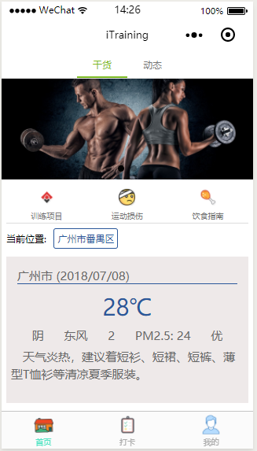

授权获取用户信息后会请求当天的天气信息，api使用了和风天气的接口，会提供当天的PM2.5 空气质量，天气情况和平均温度，以及穿衣信息。

轮播图准备接入公众号活动推送，目前为个人开发者，不提供webview接口。所以暂时不能跳转

训练项目与饮食指南同样想引流至公众号，指向公众号文章，暂不能跳转

点击运动损伤，可跳转至运动损伤常识界面，供运动员迅速查找应对办法。

点击动态，即可查看参与队伍的成员动态

##### 进入打卡界面

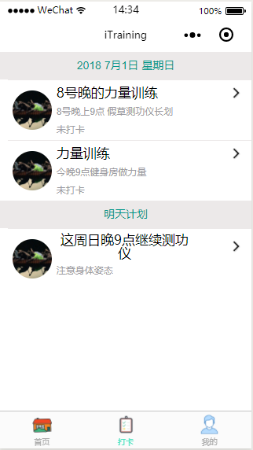

界面显示今天与明天的打卡任务。已打卡项会有标注。

点击某一项进入查看打卡的任务详情

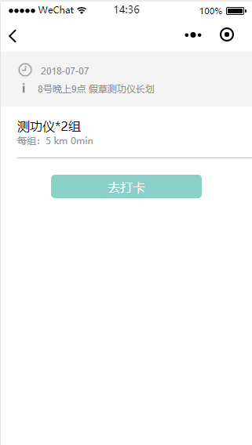

点击去打卡 到达打卡完成界面

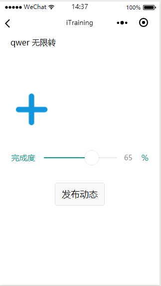

打卡界面可以添加文字描述打卡之后的心情，添加照片（一张），再次点击图片可替换图片。长按图片删除图片。滑动完成度可给自己完成内容打分。点击发布动态可以完成打卡并发布动态。打卡完成后会跳转至打卡界面。

##### 进入动态界面

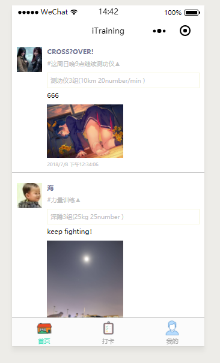

在首页点击动态按钮，即可切换至动态界面，这里可以查看队友打卡详情，打卡感想以及配图，打卡时间等。

##### 个人界面

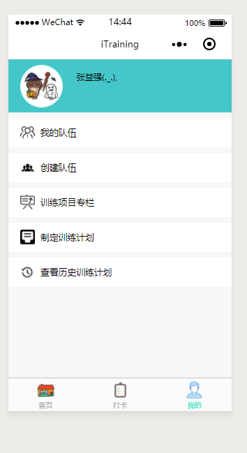

- 点击我的队伍   -- 查看我加入的队伍以及我创建的队伍

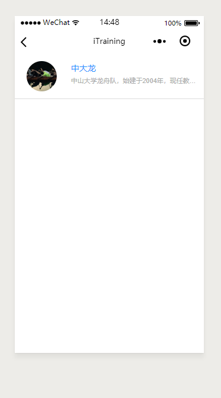

​	点击队伍可查看队伍详情包括加入的好友等。若队伍由你创建，可自由编辑队伍名称，简介，头像等。

- 点击创建队伍  - -- 可自由创建队伍，并转发邀请你的好友加入

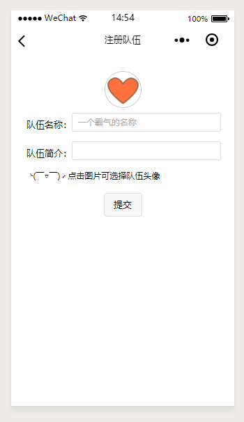

​	

- 点击训练项目专栏---可查看或自定义训练项目，有不同的指标。

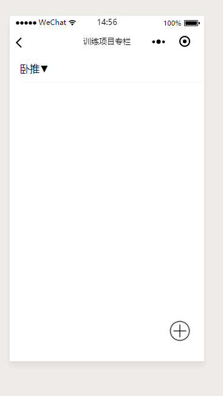

- 点击制定训练计划 -- 可为你创建的队伍指派训练计划。 

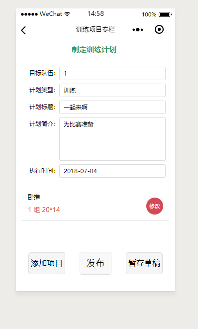

- 点击历史训练计划  --可查看本人已打卡记录

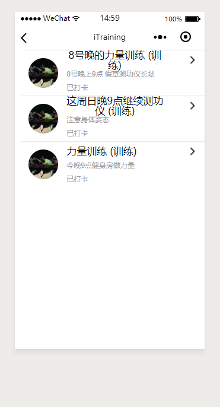

